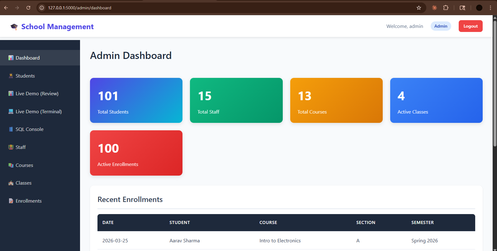
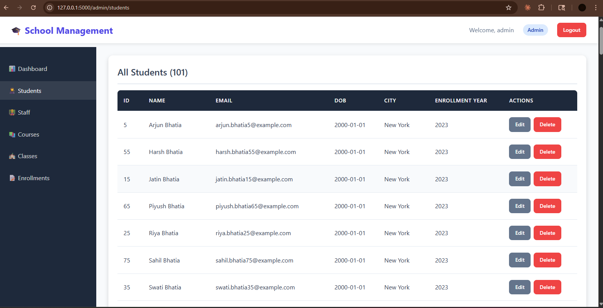
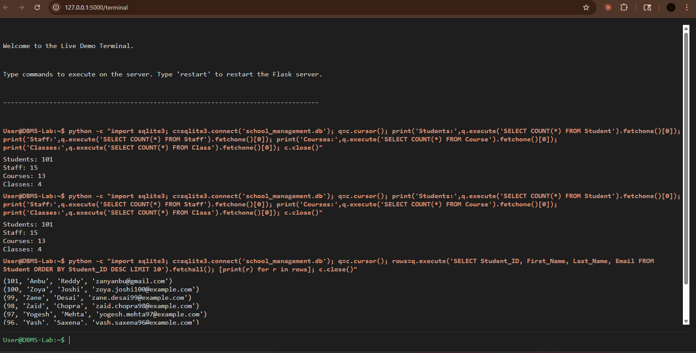
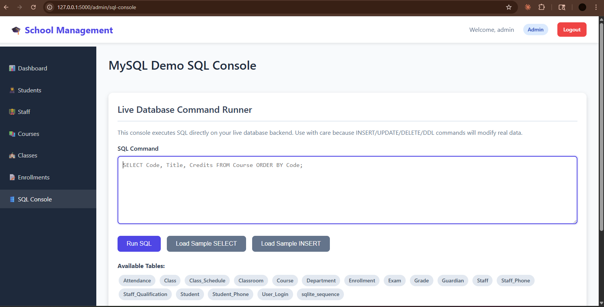

# School Management System (DBMS Project)

A robust school database and web application for managing students, staff, courses, classes, attendance, and grades.

## Overview

This project uses a normalized relational model (3NF/BCNF concepts) with strong foreign key constraints and role-based application features.

Main functional areas:
1. Staff and department management
2. Student profile and guardian tracking
3. Course, class, and enrollment management
4. Attendance and grading workflows
5. Admin SQL console and live terminal demo

## Getting Started

### Prerequisites
1. Python 3.x
2. SQLite3

### Setup
1. Clone repository:

```bash
git clone https://github.com/ZANYANBU/DBMS-project.git
cd DBMS-project
```

2. Initialize database:

```bash
python init_db.py
```

3. Start web application:

```bash
python app.py
```

4. Open in browser:

```text
http://127.0.0.1:5000
```

## Useful Commands

Verify contents:

```bash
python check_contents.py
```

Run custom SQL batch:

```bash
python run_custom.py
```

Open interactive SQL shell:

```bash
python interactive_shell.py
```

Run report queries:

```bash
python run_queries.py
```

## Screenshot Gallery

Store screenshots inside:

```text
docs/screenshots/
```

Current screenshot slots used by this README:
1. Login page
2. Student list page
3. Live terminal demo
4. SQL query demo

### Login Page



### Student List



### Live Terminal Demo



### SQL Query Demo



Recommended update commands:

```bash
git add README.md docs/screenshots/
git commit -m "Update README screenshots"
git push origin main
```

## Project Structure

1. school_management.sql: Core schema and seed data
2. init_db.py: Initializes database from SQL file
3. app.py: Flask web app with role-based dashboards
4. templates/: HTML pages for admin/staff/student/demo views
5. static/: CSS and front-end assets

## Tech Stack

1. Database: SQLite
2. Backend: Python, Flask
3. Frontend: HTML, CSS, JavaScript
4. Concepts: Relational modeling, normalization, foreign keys, joins
